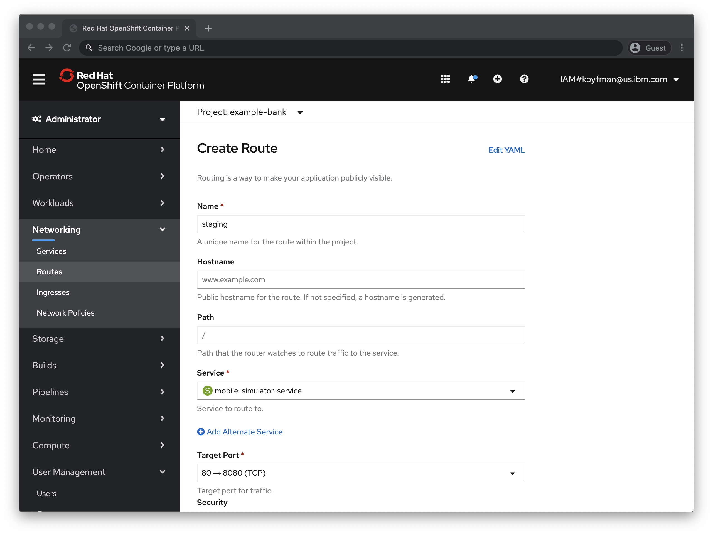
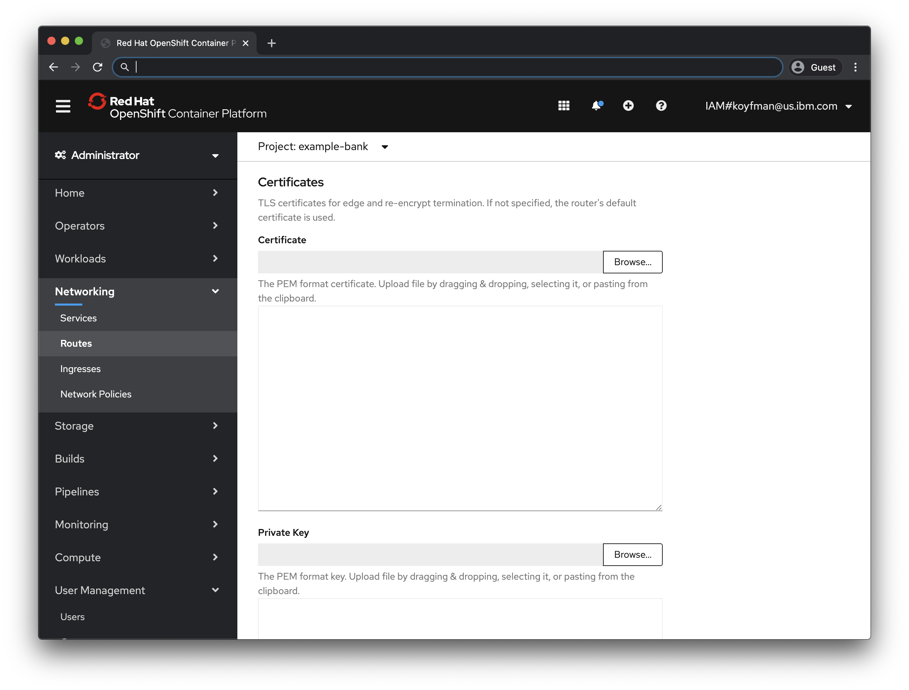
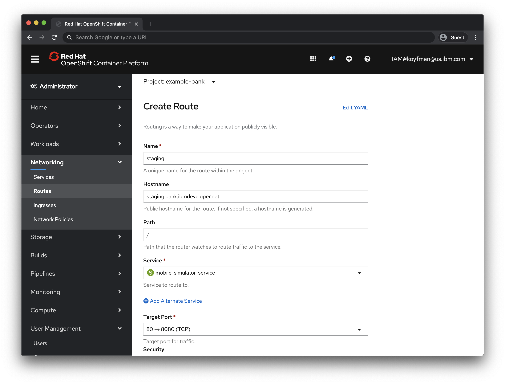
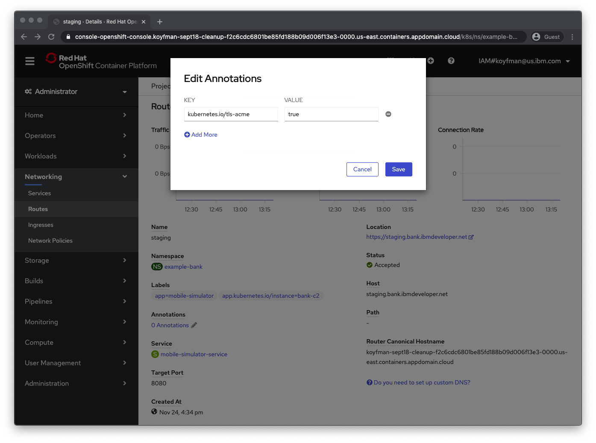
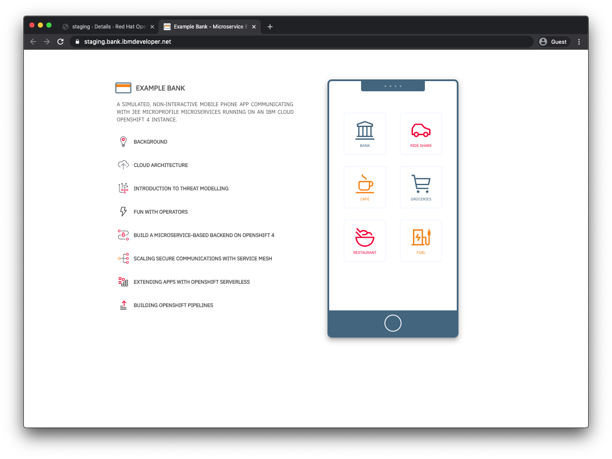
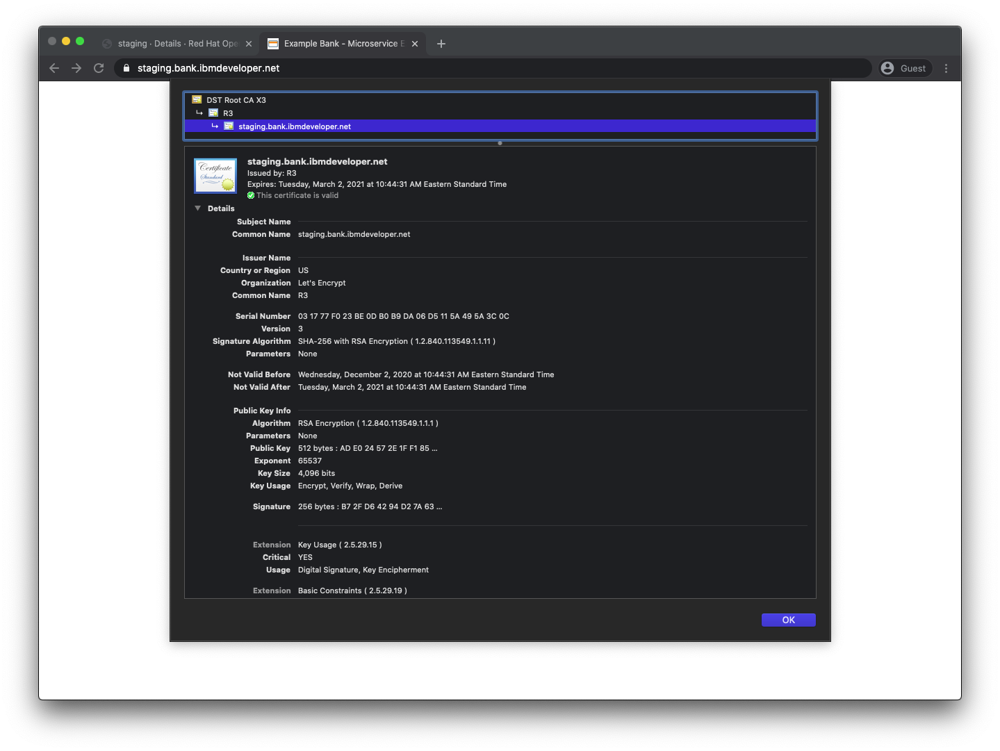

# Secure OpenShift 4.x Routes with LetsEncrypt

In this tutorial we'll look at how to set up an operator to update your OpenShift
routes to automatically obtain, verify ownership, and refresh your TLS certificates to provide secure access to your OpenShift application.

# Introduction

Securing an HTTP route in OpenShift allows clients to feel good that their data can't be snooped in transit and they are not being subjected to a man-in-the-middle attack.

We're going to show how we can add automatic certificate renewals to an instance of our [Example Bank](https://github.com/IBM/example-bank) microservices sample application.

# Prerequisites

- Access to an OpenShift 4.x cluster. The steps here were carried out with a cluster on [IBM Cloud](https://www.ibm.com/cloud/openshift).

# Estimated time

The steps here can be carried out in less than 30 minutes.

# Step 1: Create a route with the default certificate.



Create a secure route for your application, you can use the default OpenShift certificates.

Note that this creates a route that uses the OpenShift default certificates, which will generally results in errors from web browsers because its certificates will nto match the hostname, in our case, `staging.bank.ibmdeveloper.net`:





Notice also the "not secure" warning near the address bar.


We resolve the issue by using a certificate from a well-known certificate authority like LetsEncrypt.

# Step 2: Install the operator.

We're going to deploy the [acme-openshift](https://github.com/tnozicka/openshift-acme) operator, which automatically handles creating LetsEncrypt certificates, renewing them, and injecting them into `Route` objects.

Because I'm using an account with `cluster-admin` rights, we'll install the cluster-wide option so that the certificate renewals can be used on routes in any namespace. See the instructions here: https://github.com/tnozicka/openshift-acme/tree/master/deploy#cluster-wide

```

oc new-project acme-operator

oc create -fhttps://raw.githubusercontent.com/tnozicka/openshift-acme/master/deploy/cluster-wide/{clusterrole,serviceaccount,issuer-letsencrypt-live,deployment}.yaml

$  [k|acme-operator] #  oc get pods
NAME                              READY   STATUS    RESTARTS   AGE
openshift-acme-59bf8765dd-9pxgw   1/1     Running   0          16s
openshift-acme-59bf8765dd-xwngl   1/1     Running   0          16s

```

Verify that the operator is running.

# Step 3
Create a role binding for the `openshift-acme` ServiceAccount.

```
oc create clusterrolebinding openshift-acme --clusterrole=openshift-acme --serviceaccount="$( oc project -q ):openshift-acme" --dry-run -o yaml | oc create -f -
```
# Step 4

Annotate your route. This can be done either in the console (screenshot)...



or directly in the YAML:

```
metadata:
  annotations:
    kubernetes.io/tls-acme: "true"
```

At this point, the operator will use a mechanism to prove ownership of your domain by creating a new temporary route that LetsEncrypt uses to verify domain ownership:


Now visitors to `staging.bank.ibmdeveloper.net` will see a green padlock icon and no warnings about the site being insecure:



Note the certificates created with the appropriate hostname:



# Summary

In this tutorial, we went through the steps to enable secure HTTP traffic to your OpenShift routes with the "HTTP-01" challenge, a temporary route that proves domain ownership. 

# Links
LetsEncrypt challenge information
https://letsencrypt.org/docs/challenge-types/

OpenShift Operator
https://github.com/tnozicka/openshift-acme


